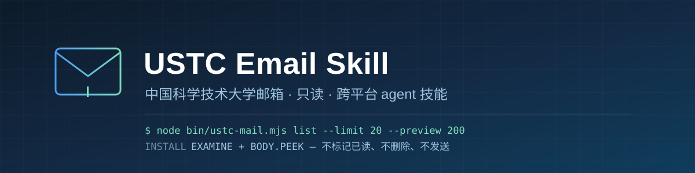
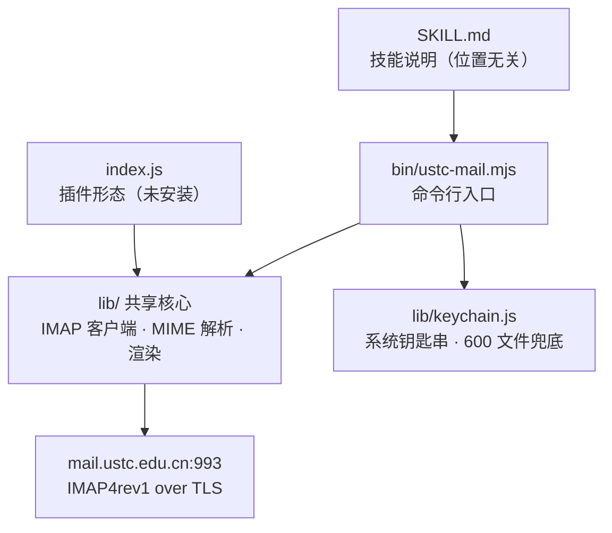
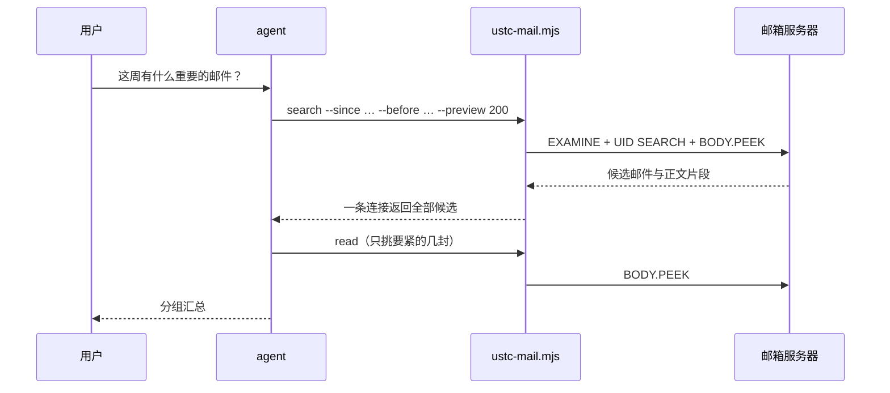

<p align="center">
  
</p>

<div align="center">

[](#安装) [](https://nodejs.org/) [](#能做什么) [](AGENTS.md#5-测试) [](LICENSE)

[安装](#安装) · [用法](#用法) · [凭据](#凭据) · [工作方式](#工作方式) · [文档](#文档) · [参与开发](AGENTS.md) · [问题反馈](https://github.com/charienustc/USTC-email-skill/issues/new)

</div>

只读访问中国科学技术大学邮箱（`mail.ustc.edu.cn`）的 agent 技能。一份可直接复制到任何 agent 的 `SKILL.md` 加一套零第三方依赖的 IMAP 实现，Windows、macOS、Linux 通用。

> [!NOTE]
> 全程只读：邮箱用 `EXAMINE` 打开、正文用 `BODY.PEEK` 取，代码里没有 STORE、COPY、EXPUNGE、APPEND，也没有 SMTP。**不会把邮件标记为已读，不会删除，不会发送，不下载附件。** 附件只列文件名、类型和大小。

## 能做什么

| | 能力 | 说明 |
| --- | --- | --- |
| 📬 | **列出邮件** | 最新 N 封的信封信息：发件人、主题、日期、已读状态、大小、有无附件 |
| 🔎 | **搜索** | 按主题、发件人、收件人、**正文**、日期区间、未读筛选；中文直接用 `CHARSET UTF-8` 发给服务器 |
| 📝 | **到处找** | `--anywhere` 一次搜「主题或正文」，不用先猜词在哪 |
| 📖 | **读取正文** | 按 `uid` 读出正文与附件清单；HTML-only 的邮件自动转纯文本 |
| 📚 | **一次读多封** | 最多 20 个 `uid` 一条连接读完；找不到的那个单独列出，不影响其余 |
| ⚡ | **正文片段** | `--preview` 给整个列表附上每封的正文开头，**在同一条连接里完成**，用来做汇总 |
| 📎 | **保存附件** | 把附件写进指定目录，文件名重建成安全名，可只取某一个 |
| 🔒 | **邮箱只读** | 协议层就不具备写能力，不是靠约定 |
| 🔑 | **凭据** | 按平台自动选系统钥匙串，无钥匙串时回退权限 600 的文件 |
| 📦 | **可移植** | 技能自带代码、自己定位目录，复制到任何 agent 或操作系统即可用 |
| 🧩 | **零依赖** | 全部用 Node 内置模块实现，包括 IMAP4rev1 客户端本身 |

## 安装

1. 需要 **Node.js 18 或更高**（本机已有则跳过）。
2. 把 [`dist/ustc-mail/`](dist/ustc-mail/) 整个目录复制到你的 agent 技能目录：

   ```sh
   # DSH
   cp -r dist/ustc-mail "$DSH_HOME/skills/ustc-mail"

   # Claude Code 及同类
   cp -r dist/ustc-mail ~/.claude/skills/ustc-mail
   ```

3. 录入凭据（**需要你自己在终端里跑**，agent 无法代答）：

   ```sh
   node bin/setup-credentials.mjs
   ```

`SKILL.md` 会自己定位所在目录，**放在哪里都能用**，不会因为换个路径就失效。

> [!TIP]
> 不想用预构建的包，可以克隆本仓后自己构建：`node tools/build-skill.mjs` 产出 `dist/ustc-mail`，`--check` 检查产物是否与源码一致，`--install` 顺带装进技能目录。

## 用法

```sh
node bin/ustc-mail.mjs list --limit 20                            # 最新 20 封
node bin/ustc-mail.mjs search --subject 账单 --since 2026-09-01    # 按主题和时间搜
node bin/ustc-mail.mjs search --anywhere 报销                      # 主题或正文里提到它
node bin/ustc-mail.mjs read 100002                                # 读某一封的正文
node bin/ustc-mail.mjs read 100001 100002 100003                  # 一次读多封，一条连接
node bin/ustc-mail.mjs list --limit 20 --preview 200               # 带正文片段，汇总用
node bin/ustc-mail.mjs attach 100002 --out ./attachments           # 保存附件
```

| 命令 | 参数 |
| --- | --- |
| `list` | `--limit`（1–100）、`--unread`、`--preview`（0–600） |
| `search` | `--subject` `--from` `--to` `--body` `--anywhere` `--since` `--before` `--unread`，**至少给一个** |
| `read <uid>...` | 最多 20 个 uid；`--max-chars`（500–200000，单封默认 20000，多封默认 2000） |
| `attach <uid>` | `--out`（默认 `ustc-mail-attachments`）、`--name`、`--index` |

四者都支持 `--folder`（默认 `INBOX`，中文文件夹名可用）和 `--json`；`--help` 看全部。

> [!WARNING]
> `attach` 是**唯一会写磁盘**的命令，其余只读。附件名由发件人决定，所以每个名字都会被重建成安全名——只取最后一段、替换路径分隔符与控制字符、给 Windows 保留名加前缀。报告时请用**实际写出的文件名**，不要用邮件里声明的原名。

`read` 的 `uid` 只能从 `list` 或 `search` 得到，所以流程是先列或搜、再读。

> [!IMPORTANT]
> **每次调用都是一条新的 IMAP 连接**（含 TLS 握手，约 0.3–3 秒，与邮件大小无关）。所以粗筛要用 `--preview`，把 `read` 留给真正要细看的少数几封：5 封分别读约 2.7 秒，一条 `list --preview` 只要 0.5 秒。
>
> 要读**多封**时，把 uid 一次性交给 `read`（`read 1 2 3`）——它只在**一条连接**里全部读完，不要循环调用。

## 凭据

按顺序查找：插件配置 → 环境变量 → **当前系统的钥匙串** → `~/.dsh/ustc-mail-credentials.json`（权限 600）。

| 平台 | 钥匙串 | 在哪里查看或删除 |
| --- | --- | --- |
| Windows | 凭据管理器 | 控制面板 → 凭据管理器 → Windows 凭据 |
| macOS | 钥匙串 | 钥匙串访问.app |
| Linux | Secret Service（需要 `secret-tool`） | GNOME/KDE 的「密码与密钥」 |
| 任意平台 | 兜底：权限 600 的文件 | 直接编辑 `~/.dsh/ustc-mail-credentials.json` |

**没有钥匙串的机器（例如无桌面的 Linux 服务器）会静默跳过那一层**，直接用文件，不会因此失败。**命令在、服务不在**（headless Linux 上很常见）也一样：读会静默回退，**写会在失败时退回文件并告诉你原因**，不会让你白输一遍授权码。

```sh
node bin/setup-credentials.mjs            # 录入：关回显，保存前校验账号，保存后验证登录
node bin/setup-credentials.mjs --show     # 查看凭据来源（不显示密码）
node bin/setup-credentials.mjs --remove   # 忘掉已保存的凭据
```

账号若开了二次验证，口令要填邮箱设置里生成的**客户端授权码**。

> [!WARNING]
> 钥匙串和权限 600 的文件都能挡住离线副本和同机器的其他账户，但**挡不住以你的身份运行的程序**——这是本机存储的固有限制。另外不要把授权码放进用户级环境变量：环境变量会继承给每个子进程，比文件传播得更广。

Windows 另有一个可选的图形弹窗 `windows-extra\setup-credentials-gui.ps1`，它只是薄壳，校验与存储逻辑仍在那份 `.mjs` 里。

## 工作方式

技能本身不含代码，而是告诉 agent **该跑哪条命令**。真正的实现是一套零依赖的 Node 程序，两条入口共用同一个核心：



一次汇总请求的过程——粗筛只用一条连接，只有少数几封才单独展开：



`EXAMINE` 让服务器强制只读，`BODY.PEEK` 在语法上就不会设置 `\Seen`——**只读是协议保证的，不是靠 agent 自觉。**

## 文档

| 文档 | 内容 |
| --- | --- |
| [docs/README.md](docs/README.md) | 文档总入口 |
| [docs/FEATURES.md](docs/FEATURES.md) | 能力清单、使用条件与已知限制 |
| [docs/BACKLOG.md](docs/BACKLOG.md) | 当前问题、功能计划与待验收事项 |
| [docs/SECURITY-AUDIT-2026-10-06.md](docs/SECURITY-AUDIT-2026-10-06.md) | 安全审计、威胁模型与残余风险 |
| [docs/VERIFICATION.md](docs/VERIFICATION.md) | 真机验证记录与测试覆盖 |
| [AGENTS.md](AGENTS.md) | 参与开发：仓库布局、改动流程、安全规则 |

## 许可

本仓代码采用 **MIT**，见 [LICENSE](LICENSE)。可自由使用、修改、分发，甚至闭源商用，只需保留版权声明——这正是它做成可移植技能的目的。

本项目的实现全部自行完成，**不含任何第三方库**。
