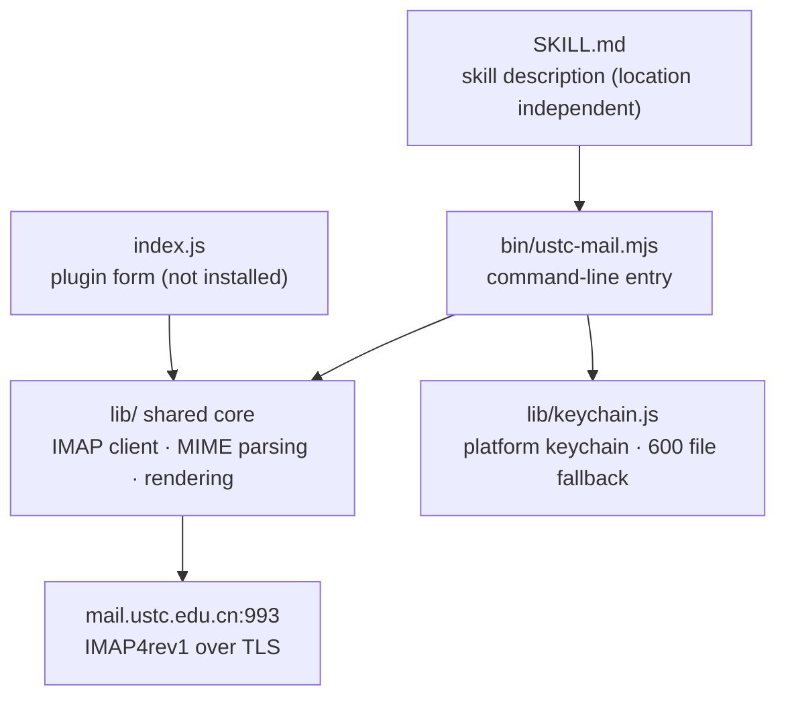
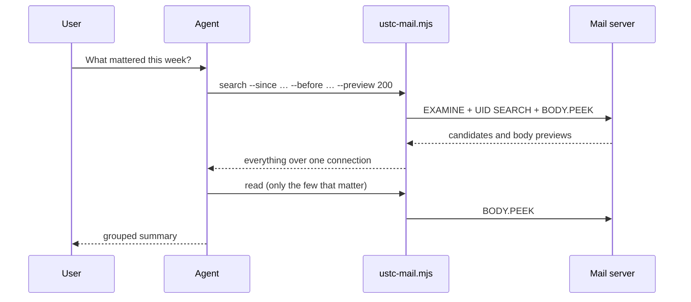

<p align="center">
  
</p>

<div align="center">

[简体中文](README.md) | **English**

[](#install) [](https://nodejs.org/) [](#what-it-does) [](AGENTS.md#5-测试) [](LICENSE)

[Install](#install) · [Usage](#usage) · [Credentials](#credentials) · [How it works](#how-it-works) · [Documentation](#documentation) · [Contributing](AGENTS.md) · [Issues](https://github.com/charienustc/USTC-email-skill/issues/new)

</div>

An agent skill for read-only access to a University of Science and Technology of China mailbox (`mail.ustc.edu.cn`). One `SKILL.md` you can copy into any agent, plus an IMAP implementation with **zero third-party dependencies** that runs on Windows, macOS, and Linux.

> [!NOTE]
> Read-only throughout. The mailbox is opened with `EXAMINE` and bodies are fetched with `BODY.PEEK`; there is no `STORE`, `COPY`, `EXPUNGE`, `APPEND`, or SMTP anywhere in the code. **Nothing is marked read, deleted, or sent, and nothing is removed from or changed in the mailbox.** The one write the tool performs is `attach` saving an attachment into a directory on *your* machine — the mailbox side is untouched.

> [!IMPORTANT]
> `SKILL.md` — the file your agent actually reads — is written in Chinese, as are the documents under [`docs/`](docs/). The command-line interface, `--help`, and every error message are in English, so the tool itself is usable without reading Chinese. If you need an English `SKILL.md`, please [open an issue](https://github.com/charienustc/USTC-email-skill/issues/new).

## What it does

| | Capability | Notes |
| --- | --- | --- |
| 📬 | **List messages** | Envelope of the newest N: sender, subject, date, read state, size, whether there are attachments |
| 🔎 | **Search** | By subject, sender, recipient, **body**, date range, unread; Chinese goes out as `CHARSET UTF-8` |
| 📝 | **Search anywhere** | `--anywhere` searches the subject *or* the body in one call, so you need not guess where a word is |
| 📖 | **Read a body** | By `uid`, returning the text body and the attachment list; HTML-only mail is converted to text |
| 📚 | **Read several** | Up to 20 uids over **one** connection; a uid that is not found is listed separately and does not lose the rest |
| ⚡ | **Body previews** | `--preview` adds the opening of each body to a whole listing, **in the same connection**, for triage |
| 📎 | **Save attachments** | Writes an attachment into a directory, with the filename rebuilt into a safe one; pick one by name or index |
| 🔒 | **Read-only mailbox** | The protocol layer has no write capability; this is not a convention |
| 🔑 | **Credentials** | Picks the platform keychain, falling back to a 600 file when there is none |
| 📦 | **Portable** | The skill carries its own code and locates its own directory; copy it to any agent or OS |
| 🧩 | **Zero dependencies** | Everything is built on Node's own modules, including the IMAP4rev1 client itself |

## Install

1. **Node.js 18 or newer** (skip if you already have it).
2. Copy the whole [`dist/ustc-mail/`](dist/ustc-mail/) directory into your agent's skills directory:

   ```sh
   # DSH
   cp -r dist/ustc-mail "$DSH_HOME/skills/ustc-mail"

   # Claude Code and similar
   cp -r dist/ustc-mail ~/.claude/skills/ustc-mail
   ```

3. Enter your credentials (**you have to run this yourself in a terminal** — an agent cannot answer the prompt):

   ```sh
   node bin/setup-credentials.mjs
   ```

`SKILL.md` locates its own directory, so **it works from wherever you put it**; moving it does not break it.

> [!TIP]
> You do not have to use the prebuilt bundle. Clone this repository and build it yourself: `node tools/build-skill.mjs` produces `dist/ustc-mail`, `--check` verifies the output still matches the source, and `--install` also drops it into your skills directory.

## Usage

```sh
node bin/ustc-mail.mjs list --limit 20                            # newest 20
node bin/ustc-mail.mjs search --subject 账单 --since 2026-09-01    # by subject and date
node bin/ustc-mail.mjs search --anywhere 报销                      # subject or body mentions it
node bin/ustc-mail.mjs read 100002                                # read one body
node bin/ustc-mail.mjs read 100001 100002 100003                  # read several, one connection
node bin/ustc-mail.mjs list --limit 20 --preview 200               # with body previews, for a digest
node bin/ustc-mail.mjs attach 100002 --out ./attachments           # save an attachment
```

| Command | Options |
| --- | --- |
| `list` | `--limit` (1–100), `--unread`, `--preview` (0–600) |
| `search` | `--subject` `--from` `--to` `--body` `--anywhere` `--since` `--before` `--unread` — **at least one** |
| `read <uid>...` | up to 20 uids; `--max-chars` (500–200000; 20000 for one, 2000 for several) |
| `attach <uid>` | `--out` (defaults to `ustc-mail-attachments`), `--name`, `--index` |

All four accept `--folder` (defaults to `INBOX`; Chinese folder names work) and `--json`; `--help` shows everything.

> [!WARNING]
> `attach` is the **only command that writes to disk**; the rest are read-only. The sender chooses the attachment filename, so every name is rebuilt into a safe one — only the last path component survives, path separators and control characters are replaced, and Windows device names get a prefix. When reporting, use the **filename that was actually written**, not the one the mail declared.

A `uid` can only come from `list` or `search`, so the flow is: list or search first, then read.

> [!IMPORTANT]
> **Every invocation opens a new IMAP connection** (TLS handshake included, roughly 0.3–3 seconds regardless of message size). So use `--preview` to triage and save `read` for the few messages you genuinely need: five separate reads cost about 2.7 seconds, while one `list --preview` costs about 0.5.
>
> To read **several** messages, hand all the uids to `read` at once (`read 1 2 3`) — it reads them all over **one** connection. Do not call it in a loop.

## Credentials

Looked up in order: plugin config → environment variables → **the platform keychain** → `~/.dsh/ustc-mail-credentials.json` (mode 600).

| Platform | Keychain | Where to view or delete it |
| --- | --- | --- |
| Windows | Credential Manager | Control Panel → Credential Manager → Windows Credentials |
| macOS | Keychain | Keychain Access.app |
| Linux | Secret Service (needs `secret-tool`) | "Passwords and Keys" in GNOME/KDE |
| Any | Fallback: a mode-600 file | Edit `~/.dsh/ustc-mail-credentials.json` directly |

**A machine with no keychain (a headless Linux server, say) silently skips that layer** and uses the file, without failing. The same is true when **the command exists but the service does not** (common on headless Linux): reads fall back silently, and **a write falls back to the file and tells you why**, so the code you just typed is never lost.

```sh
node bin/setup-credentials.mjs            # enter: no echo, validated before saving, login checked after
node bin/setup-credentials.mjs --show     # show where the credentials come from (never the secret)
node bin/setup-credentials.mjs --remove   # forget the stored credentials
```

If the account has two-factor authentication, the secret is the **client authorization code** generated in the mailbox settings, not your login password.

> [!WARNING]
> A keychain and a mode-600 file both stop offline copies and other accounts on the same machine, but **neither stops a program running as you** — that is inherent to storing anything locally. Also, do not put the authorization code in a user-level environment variable: environment variables are inherited by every child process, so they spread further than a file does.

Windows has an optional graphical prompt at `windows-extra\setup-credentials-gui.ps1`. It is a thin shell; the validation and storage logic stays in the `.mjs`.

## How it works

The skill contains no code of its own. It tells the agent **which command to run**. The implementation is a dependency-free Node program, and the two entry points share one core:



One digest request — triage over a single connection, and only a few messages opened individually:



`EXAMINE` makes the server enforce read-only, and `BODY.PEEK` does not set `\Seen` by construction — **read-only is guaranteed by the protocol, not by the agent's self-restraint.**

## Documentation

| Document | Contents |
| --- | --- |
| [docs/README.md](docs/README.md) | Documentation index (Chinese) |
| [docs/FEATURES.md](docs/FEATURES.md) | Capabilities, requirements, and known limits (Chinese) |
| [docs/BACKLOG.md](docs/BACKLOG.md) | Open issues, plans, and what is not yet verified (Chinese) |
| [docs/SECURITY-AUDIT-2026-10-06.md](docs/SECURITY-AUDIT-2026-10-06.md) | Security audit, threat model, residual risk (Chinese) |
| [docs/VERIFICATION.md](docs/VERIFICATION.md) | Real-machine verification log and test coverage (Chinese) |
| [AGENTS.md](AGENTS.md) | Contributing: repository layout, workflow, security rules (Chinese) |

## License

**MIT**, see [LICENSE](LICENSE). Use it, modify it, redistribute it, even in closed-source commercial work — you only have to keep the copyright notice. That is exactly why it is packaged as a portable skill.

Everything here is implemented from scratch and **contains no third-party libraries**.
